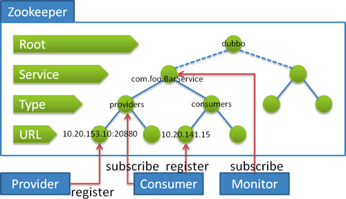

博客地址：https://developer.aliyun.com/article/923654

Apache Dubbo 

官网：https://dubbo.apache.org/zh/

Dubbo 提供的基础能力包括：

- 服务发现
- 流式通信
- 负载均衡
- 流量治理

Zookeeper 简介

Zookeeper 是 Apache Hadoop 的子项目，是一个树型的目录服务，支持变更推送，
适合作为 Dubbo 服务的注册中心，工业强度较高，可用于生产环境。

maven 命令：

mvn clean install -Dmaven.test.skip=true

mvn -U idea:idea